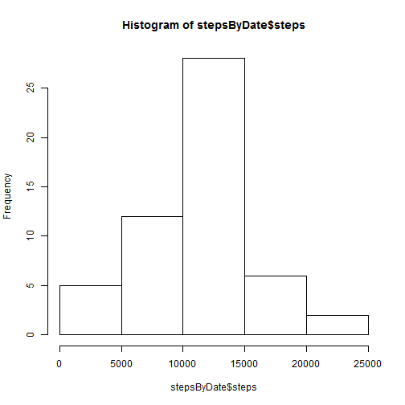
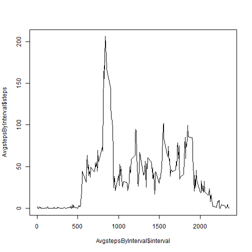
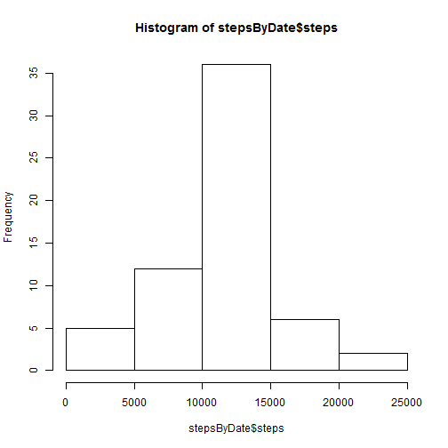

Reproducible Data Peer Assignment 1
=======================================================

This is my first R markdown file.

Load the activity.csv file into R.


```r
activity <- read.csv("./Data/activity.csv")
summary(activity)
```

```
##      steps               date          interval   
##  Min.   :  0.0   2012-10-01:  288   Min.   :   0  
##  1st Qu.:  0.0   2012-10-02:  288   1st Qu.: 589  
##  Median :  0.0   2012-10-03:  288   Median :1178  
##  Mean   : 37.4   2012-10-04:  288   Mean   :1178  
##  3rd Qu.: 12.0   2012-10-05:  288   3rd Qu.:1766  
##  Max.   :806.0   2012-10-06:  288   Max.   :2355  
##  NA's   :2304    (Other)   :15840
```

```r
str(activity)
```

```
## 'data.frame':	17568 obs. of  3 variables:
##  $ steps   : int  NA NA NA NA NA NA NA NA NA NA ...
##  $ date    : Factor w/ 61 levels "2012-10-01","2012-10-02",..: 1 1 1 1 1 1 1 1 1 1 ...
##  $ interval: int  0 5 10 15 20 25 30 35 40 45 ...
```


Remove the NA values using the complete function and store it into the a new data frame.


```r
activityComplete <- activity[complete.cases(activity), ]
summary(activityComplete)
```

```
##      steps               date          interval   
##  Min.   :  0.0   2012-10-02:  288   Min.   :   0  
##  1st Qu.:  0.0   2012-10-03:  288   1st Qu.: 589  
##  Median :  0.0   2012-10-04:  288   Median :1178  
##  Mean   : 37.4   2012-10-05:  288   Mean   :1178  
##  3rd Qu.: 12.0   2012-10-06:  288   3rd Qu.:1766  
##  Max.   :806.0   2012-10-07:  288   Max.   :2355  
##                  (Other)   :13536
```

```r
str(activityComplete)
```

```
## 'data.frame':	15264 obs. of  3 variables:
##  $ steps   : int  0 0 0 0 0 0 0 0 0 0 ...
##  $ date    : Factor w/ 61 levels "2012-10-01","2012-10-02",..: 2 2 2 2 2 2 2 2 2 2 ...
##  $ interval: int  0 5 10 15 20 25 30 35 40 45 ...
```


Create a dataframe with aggregated steps taken each day.


```r
stepsByDate <- aggregate(activityComplete$steps, by = list(Category = activityComplete$date), 
    FUN = sum)
names(stepsByDate) <- c("date", "steps")
summary(stepsByDate)
```

```
##          date        steps      
##  2012-10-02: 1   Min.   :   41  
##  2012-10-03: 1   1st Qu.: 8841  
##  2012-10-04: 1   Median :10765  
##  2012-10-05: 1   Mean   :10766  
##  2012-10-06: 1   3rd Qu.:13294  
##  2012-10-07: 1   Max.   :21194  
##  (Other)   :47
```

```r
str(stepsByDate)
```

```
## 'data.frame':	53 obs. of  2 variables:
##  $ date : Factor w/ 61 levels "2012-10-01","2012-10-02",..: 2 3 4 5 6 7 9 10 11 12 ...
##  $ steps: int  126 11352 12116 13294 15420 11015 12811 9900 10304 17382 ...
```


Create histogram of steps taken each day.

```r
hist(stepsByDate$steps)
```

 


Calculate mean and media total number of steps taken per day.

```r
mean(stepsByDate$steps)
```

```
## [1] 10766
```

```r
median(stepsByDate$steps)
```

```
## [1] 10765
```


Create data frame of avergage steps taken at a time interval accross all days.

```r
AvgstepsByInterval <- aggregate(activityComplete$steps, by = list(Category = activityComplete$interval), 
    FUN = mean)
names(AvgstepsByInterval) <- c("interval", "steps")
summary(AvgstepsByInterval)
```

```
##     interval        steps       
##  Min.   :   0   Min.   :  0.00  
##  1st Qu.: 589   1st Qu.:  2.49  
##  Median :1178   Median : 34.11  
##  Mean   :1178   Mean   : 37.38  
##  3rd Qu.:1766   3rd Qu.: 52.83  
##  Max.   :2355   Max.   :206.17
```

```r
str(AvgstepsByInterval)
```

```
## 'data.frame':	288 obs. of  2 variables:
##  $ interval: int  0 5 10 15 20 25 30 35 40 45 ...
##  $ steps   : num  1.717 0.3396 0.1321 0.1509 0.0755 ...
```


Create line plot

```r
plot(AvgstepsByInterval$interval, AvgstepsByInterval$steps, type = "l")
```

 


Calculate number of rows coded as NA

```r
sum(is.na(activity$steps))
```

```
## [1] 2304
```


Merge the average steps by interval with the activity table

```r
mergeActivity <- merge(activity, AvgstepsByInterval, by.x = "interval", by.y = "interval", 
    all = TRUE)
```

Replace all NA values in steps with the average steps for that interval

```r
mergeActivity <- transform(mergeActivity, steps.x = ifelse(is.na(steps.x), steps.y, 
    steps.x))
mergeActivity <- data.frame(mergeActivity[, c(1, 2, 3)])
names(mergeActivity) <- c("interval", "steps", "date")
summary(mergeActivity)
```

```
##     interval        steps               date      
##  Min.   :   0   Min.   :  0.0   2012-10-01:  288  
##  1st Qu.: 589   1st Qu.:  0.0   2012-10-02:  288  
##  Median :1178   Median :  0.0   2012-10-03:  288  
##  Mean   :1178   Mean   : 37.4   2012-10-04:  288  
##  3rd Qu.:1766   3rd Qu.: 27.0   2012-10-05:  288  
##  Max.   :2355   Max.   :806.0   2012-10-06:  288  
##                                 (Other)   :15840
```

```r
str(mergeActivity)
```

```
## 'data.frame':	17568 obs. of  3 variables:
##  $ interval: int  0 0 0 0 0 0 0 0 0 0 ...
##  $ steps   : num  1.72 0 0 0 0 ...
##  $ date    : Factor w/ 61 levels "2012-10-01","2012-10-02",..: 1 54 28 37 55 46 20 47 38 56 ...
```

Create a dataframe with aggregated steps taken each day for the new dataset

```r
stepsByDate <- aggregate(mergeActivity$steps, by = list(Category = mergeActivity$date), 
    FUN = sum)
names(stepsByDate) <- c("date", "steps")
summary(stepsByDate)
```

```
##          date        steps      
##  2012-10-01: 1   Min.   :   41  
##  2012-10-02: 1   1st Qu.: 9819  
##  2012-10-03: 1   Median :10766  
##  2012-10-04: 1   Mean   :10766  
##  2012-10-05: 1   3rd Qu.:12811  
##  2012-10-06: 1   Max.   :21194  
##  (Other)   :55
```

```r
str(stepsByDate)
```

```
## 'data.frame':	61 obs. of  2 variables:
##  $ date : Factor w/ 61 levels "2012-10-01","2012-10-02",..: 1 2 3 4 5 6 7 8 9 10 ...
##  $ steps: num  10766 126 11352 12116 13294 ...
```

Create histogram of steps taken each day for the new dataset

```r
hist(stepsByDate$steps)
```

 

Calculate mean and media total number of steps taken per day for the new dataset

```r
mean(stepsByDate$steps)
```

```
## [1] 10766
```

```r
median(stepsByDate$steps)
```

```
## [1] 10766
```

Append Day of week to the dataframe with the NA replaced

```r
mergeActivity$DayOfWeek <- weekdays(as.POSIXlt(mergeActivity$date, format = "%Y-%m-%d"))
```

Set factor variables for Weekend

```r
mergeActivity$DayType
```

```
## NULL
```


Create data frame of avergage steps taken at a time interval accross all days for the new dataset

```r
AvgstepsByInterval <- aggregate(mergeActivity$steps, by = list(Category = mergeActivity$interval), 
    FUN = mean)
names(AvgstepsByInterval) <- c("interval", "steps")
summary(AvgstepsByInterval)
```

```
##     interval        steps       
##  Min.   :   0   Min.   :  0.00  
##  1st Qu.: 589   1st Qu.:  2.49  
##  Median :1178   Median : 34.11  
##  Mean   :1178   Mean   : 37.38  
##  3rd Qu.:1766   3rd Qu.: 52.83  
##  Max.   :2355   Max.   :206.17
```

```r
str(AvgstepsByInterval)
```

```
## 'data.frame':	288 obs. of  2 variables:
##  $ interval: int  0 5 10 15 20 25 30 35 40 45 ...
##  $ steps   : num  1.717 0.3396 0.1321 0.1509 0.0755 ...
```


